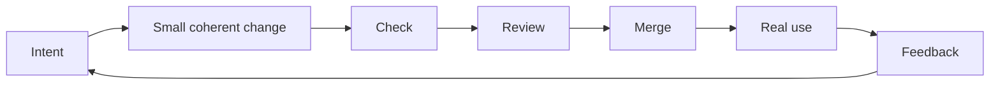

# Contributing

Read the README before changing the repository. Use a short-lived branch, keep the change coherent, and run `mise run check` before review.

## Flywheel

Intent → small coherent change → check → review → merge → real use → feedback → better next intent

Prefer conventional root documents and README files within real areas of the repository. Do not create one-off planning or status documents.
